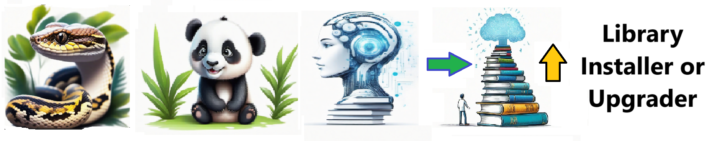

# Library Installer   - Easily bring all your Libraries up to date !!!   

## Description

## Welcome to the Library Installer repository! Easily bring all your Libraries up to date !!!  

## There are many ways to do this. It isnt perfect !!! so Experiment. Branch it and Change it. Collaborate and HAVE FUN !!! 

## Features

- Automates boring stuff 
- Easily Configurable 
- Invites Collaboration

## Notebook Features

- Self Documenting 
- Self Testing 
- Easily Configurable
- Includes Talking Code - The code explains itself
- Low Code - or - No Code

## Getting Started

To get started with the ** Library Installer  ** project, follow these steps:

1. Clone the repository to your local machine.
2. Install the required dependencies listed at the top of the notebook.
3. Explore the example code provided in the repository and experiment.
4. Run the notebook and your find your most Critical Data - EASY !

